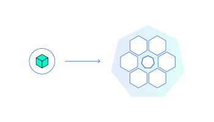
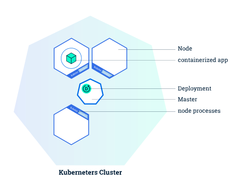
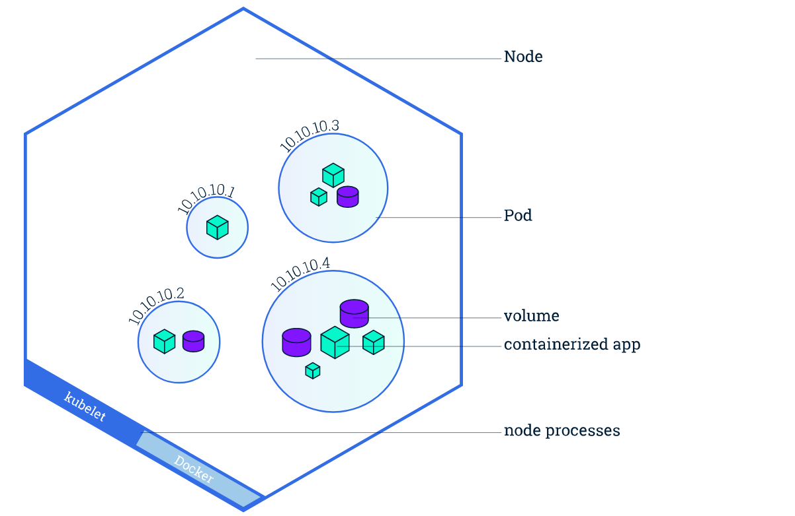
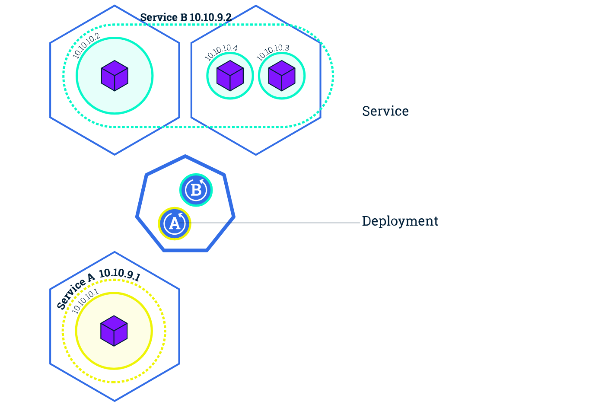
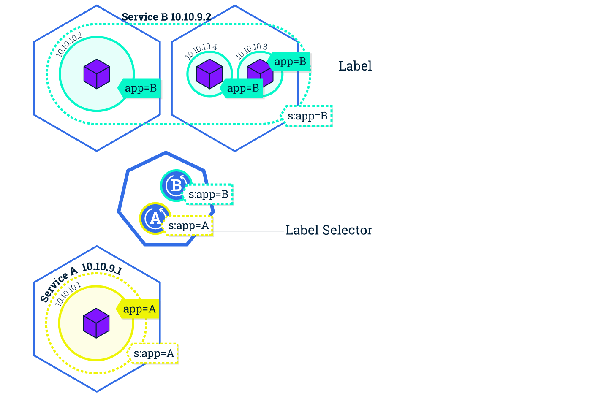
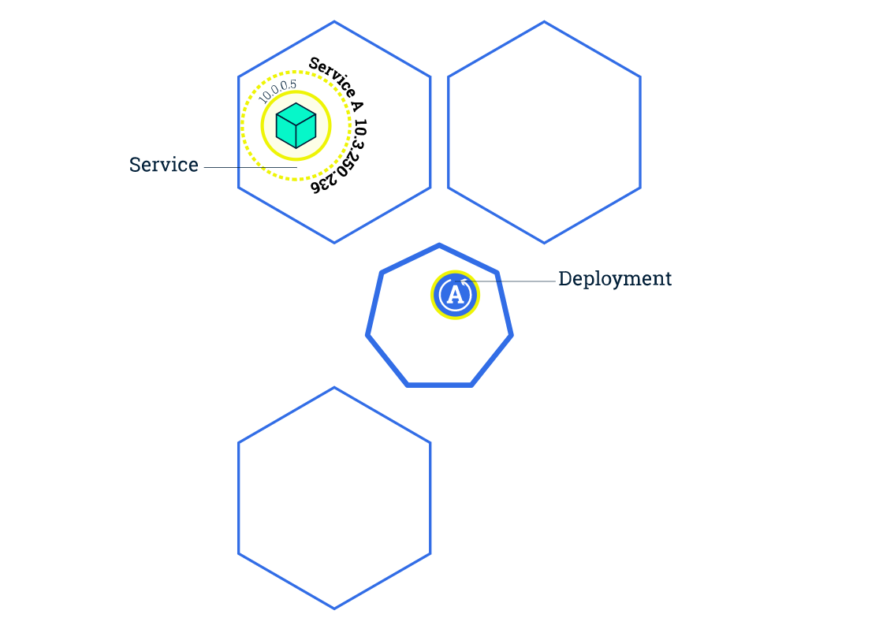
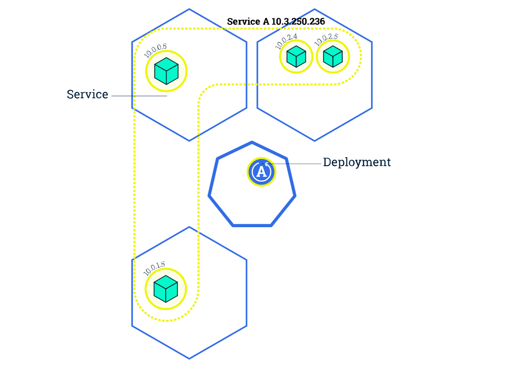
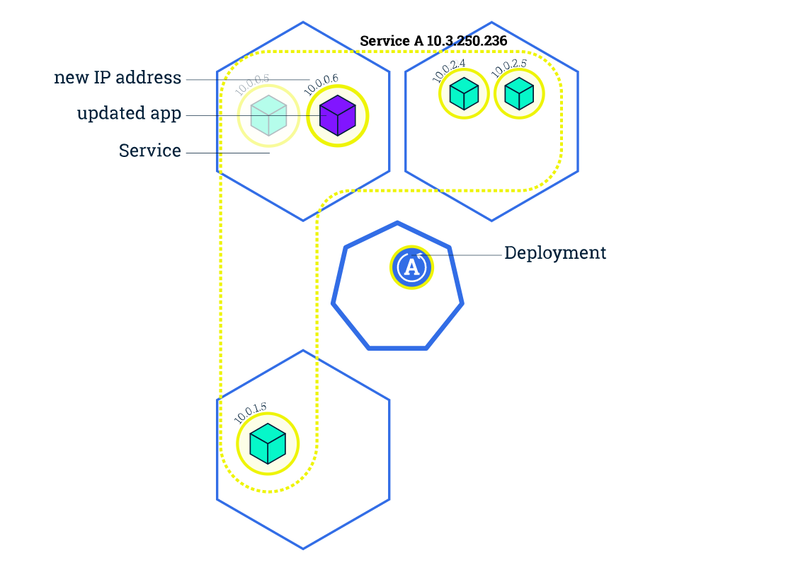
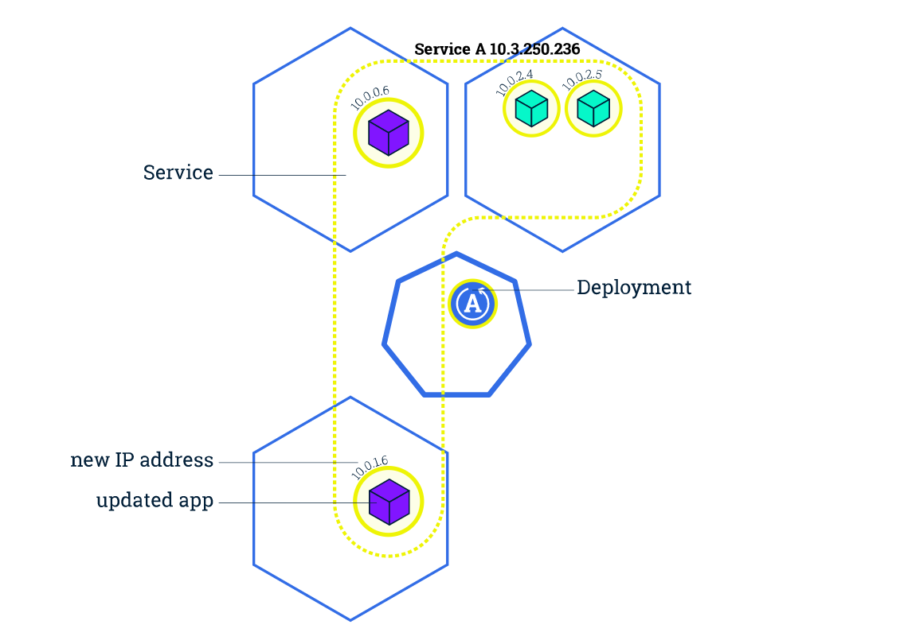
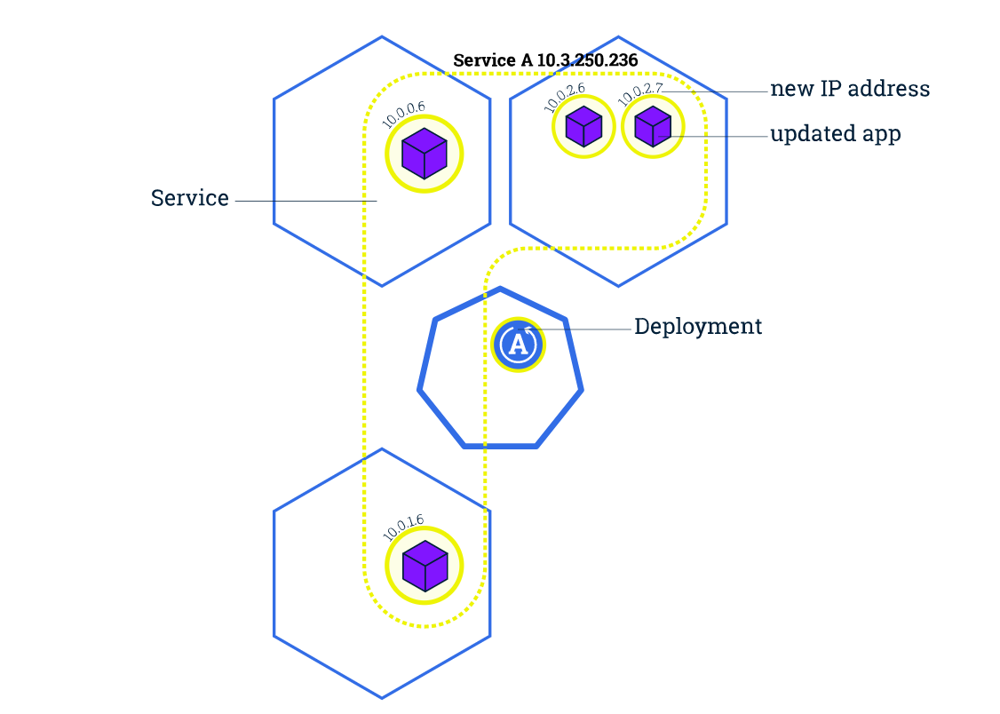

<!-- .slide: data-background="ITCAMP-2017-Cluj.svg" -->

Note:8 years ago, as part of my job, on rotation, every Saturdays, me or somebody else from my team was having the role of release manager. I was in a financial institition, and releases were happening only outside business hours. The main reason was that they were overly complicated. The other reason was that they took literally hours to deploy and it was not a straigth-forward process. The hours spent or the deployment itself were multiplied by the hours spent on preparation. A 20 page report, with roles and to-do's for 10-20 people. It's not an overestimation to say we were loosing 20-30 hours every week for deployments.
2 days ago, at a diferent company, that is actually doing weather predictions, I reviewed some code, approved it together with another colleague and merged it to the test environment.  After 10-15 minutes the code was in production, with zero downtime. Logs and monitoring were showing that all went ok. In those minutes it got build, got tested and passed via another acceptance environment on his way to the production via a continuous delivery pipeline. The time spent to actually babysit the process of deployment, was almost zero.
This presentation is about Kubernetes and this new type of applications.

---

## Agenda
  
Why:  Habits of sucessfull cloud native applications  

What: Kubernetes platform - the building blocks

How:  Deploying applications on Kubernetes (demo)    

<!-- .slide: data-background="footer.svg" -->

---

### Who Am I

Catalin Jora (Engineer @ Container Solutions)  
@jocatalin    

<!-- .slide: data-background="footer.svg" -->

Note: 

---

### Why:  Habits of sucessfull cloud native applications  

What: Kubernetes platform - the building blocks

How:  Deploying applications on Kubernetes (demo)  

<!-- .slide: data-background="footer.svg" -->

---

### Desired habits for software in 2017

Speed  

Scale  

Costs  

Note: I'm not adding quality, or stability of the software here, because those are not new things. They were valid 10, 20 years ago as well.

<!-- .slide: data-background="footer.svg" -->

---

## Speed of release  

Release cycle of software will only acelerate, will (probably) never slow down. 

Note: DevOps movement is a side-effect of this. It's trying to fix the people issues of the problem. If your competition 
is delivering software 10 times a day, and you're doing it only once every month, 
thare are big chances that you'll  not resist for long time in business.

<!-- .slide: data-background="footer.svg" -->

---

## Scale 

Software should be able to grow with user/business demand

Note: if you're still on prem, going hybrid can help. E.g. genomics companies can run their computations in house, and scale to the cloud when there is need for
<!-- .slide: data-background="footer.svg" -->

---

## Costs

Reduce infrastructure costs by moving from pay in advance to pay per use

Note: Why pay in advance? Move from pay in advance to pay per use, to pay per need.
<!-- .slide: data-background="footer.svg" -->

---

### Cloud Native Systems
> distributed systems environments capable of scaling to tens of thousands of self healing multi-tenant nodes | [cncf](cncf.io)

Note: cloud native computing foundation is being formed to shape the evolution of technologies that are container packaged, dynamically scheduled and microservices oriented
<!-- .slide: data-background="footer.svg" -->

---

### Cloud Native Applications patterns

Packed in containers
<!-- .element: class="fragment" data-fragment-index="1" -->

Dinamically managed  
<!-- .element: class="fragment" data-fragment-index="2" -->

Micro-service oriented 
<!-- .element: class="fragment" data-fragment-index="3" -->

Note: The container is the new atomic unit of application deployments. Start fast, scale fast, portable, light on resource consumption.
You will probably have a few of them. You can't manage them manually anymore. It's error prone and time consumming.
You want your container to do one thing, in accordance with docker philosphy. This allows decoupled architecture.
<!-- .slide: data-background="footer.svg" -->

---

 Why:  Habits of sucessfull cloud native applications  

### What: Kubernetes platform - the building blocks

How:  Deploying applications on Kubernetes (demo)  

<!-- .slide: data-background="footer.svg" -->

---

## What is Kubernetes
Kubernetes is a open-source platform that orchestrates the placement (scheduling) and execution of containers across a clusters
<!-- .element: class="fragment" data-fragment-index="1" -->

Note: started by Google, donated to cncf. google uses containers internally for 10 years or so. Built using experience 
from their internal systems to manage containers. Good news one of the founders of kubernetes is not at Microsoft.
<!-- .slide: data-background="footer.svg" -->

---

## Kubernetes Architecture

Note: Cluster is composed out of master and nodes. Nodes run the apps. Master is in charge of scheduling apps. master - etcd, API server, controller manager, scheduler, kubelet  Node - kubelet, docker

---

## Kubernetes components

#### master  
etcd, API server, controller manager, scheduler, kubelet  

#### nodes 
kubelet, docker

<!-- .slide: data-background="footer.svg" -->

---

## Kubernetes Deployment

* responsible for creating and updating the instances of your applications  
* provide a self-healing mechanism

<!-- .slide: data-background="footer.svg" -->

---

## Kubernetes Deployment

---

## Kubernetes Pod

* a group of one or more containers (e.g. Docker)
* shared storage & unique cluster level IP
* info about container image, ports, resources (CPU,RAM)
<!-- .slide: data-background="footer.svg" -->

---

## Kubernetes Pod

* are mortal
* are the atomic unit on Kubernetes
* deployments are creating pods with containers inside them
<!-- .slide: data-background="footer.svg" -->

---

## Kubernetes Pod

<!-- .slide: data-background="footer.svg" -->

---

## Kubernetes Node

---

## Kubernetes Service
abstraction layer which defines a logical set of Pods  

* enables external traffic exposure

* load balancing 

* service discovery for pods
<!-- .slide: data-background="footer.svg" -->

---

---

### Kubernetes Label

* key/value pairs attached to objects (E.g Pods)

* help organizing objects

* can be changed anytime
<!-- .slide: data-background="footer.svg" -->

---

---

### Scalling Applications
Changing the number of replicas in a deployment

* traffic is sent only to up & running pods

* new pods are created on nodes with available resources

* running multiple pod replicas allow zero-downtime updates
<!-- .slide: data-background="footer.svg" -->

---

---

---

### Rolling Updates
Incremental pods update for deployments  

* CI/CD with zero downtime
<!-- .slide: data-background="footer.svg" -->

---

---

---

---

## Where can you run Kubernetes

laptop  (minikube)

public cloud  (Google cloud , Azure, AWS, etc)

on-premises  

Note: my demo will run on the laptop version, called minikube
<!-- .slide: data-background="footer.svg" -->

---

## How to run Kubernetes

vanilla (you will do the maintenance)  

managed (as a service: ACS - Azure, GKE - Google cloud, Tectonic - CoreOS)   
<!-- .slide: data-background="footer.svg" -->

---

Why:  Habits of sucessfull cloud native applications  

What: Kubernetes platform - the building blocks

### How:  Deploying applications on Kubernetes (demo)  

<!-- .slide: data-background="footer.svg" -->

---

### demo

    docker image for this presentation: jocatalin/itcamp:2017
    
    
<!-- .slide: data-background="footer.svg" -->

---

### Learn Kubernetes

* Beginer:  https://katacoda.com/courses/kubernetes  https://kubernetes.io/docs/tutorials/kubernetes-basics/
 
* Advanced: https://github.com/kelseyhightower/kubernetes-the-hard-way

* https://container-solutions.com/blog
* https://cncf.io
<!-- .slide: data-background="footer.svg" -->

---

### Kubernetes take aways

- Works only with containers

-  Scale with demand 

- Make inteligent use of available resources

- Deploy apps fast with zero-downtime

- Programmable infrastructure

<!-- .slide: data-background="footer.svg" -->

---

### Multumesc!

>Questions?

<!-- .slide: data-background="footer.svg" -->
